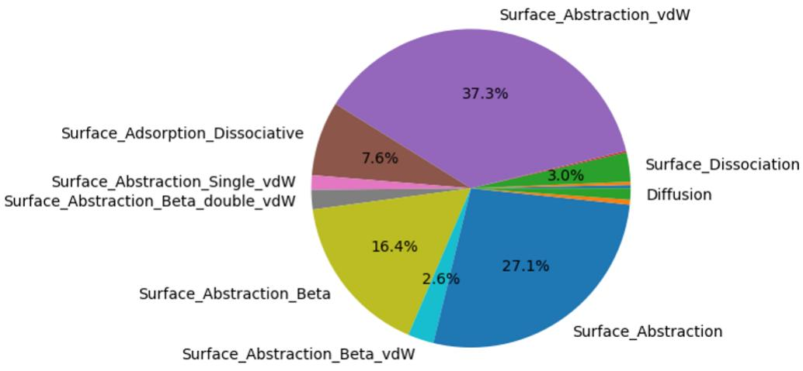
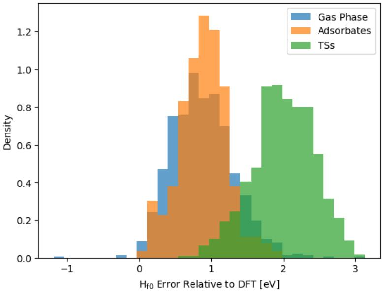
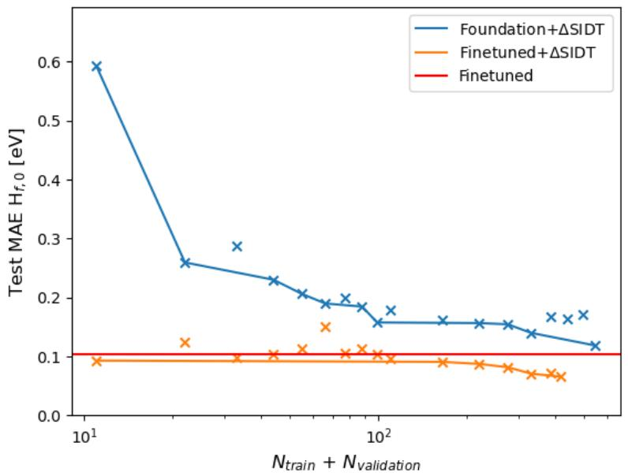
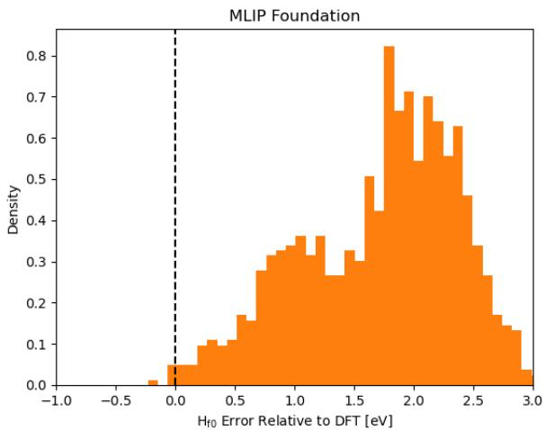
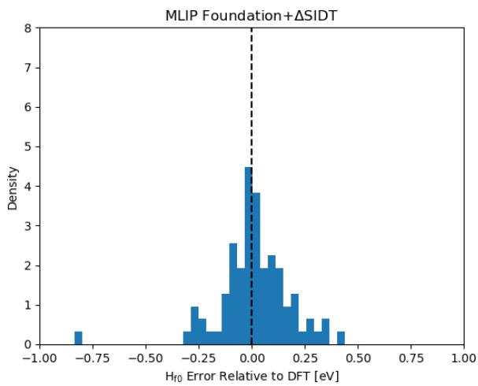
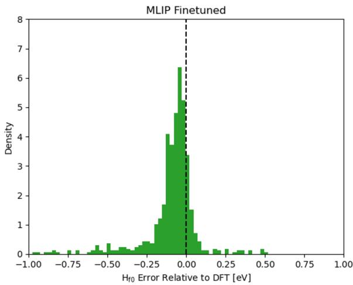
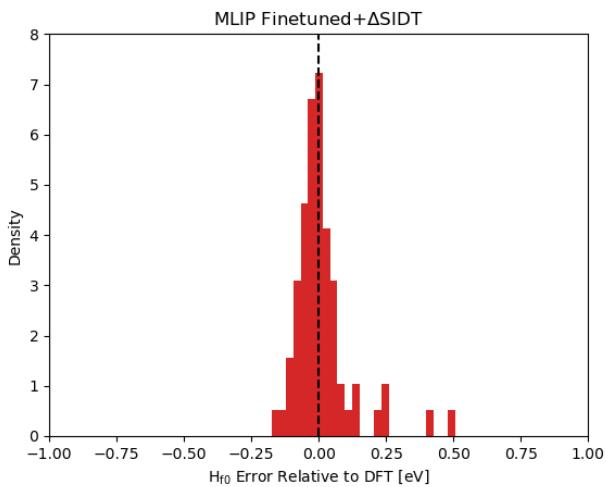
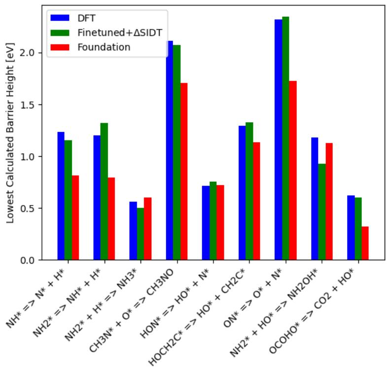
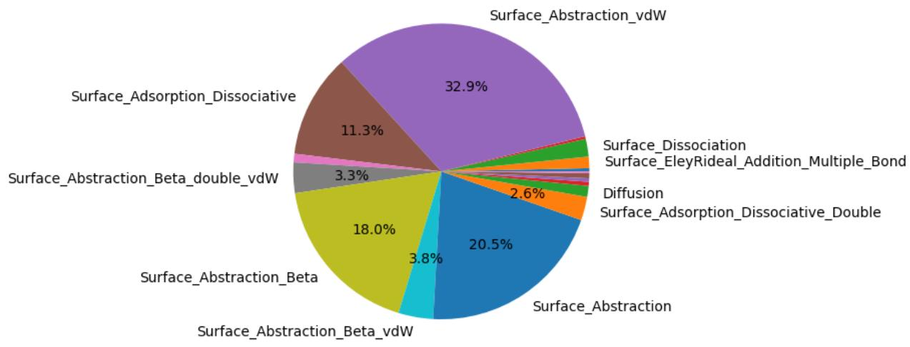

# Fusing Delta Learning and Machine Learned Interatomic Potentials for Efficient High Throughput Calculation of Surface Kinetic Parameters

> **论文标题**：Fusing Delta Learning and Machine Learned Interatomic Potentials for Efficient High Throughput Calculation of Surface Kinetic Parameters
>
> **作者**：Matthew S. Johnson (Sandia), David H. Bross (Argonne), Lars Schaaf (Cambridge), Alvaro Vazquez-Mayagoitia (Argonne), Gábor Csányi (Cambridge / MPI-P), Judit Zádor (Sandia, 通讯)
>
> **发表**：chemRxiv preprint (v1)，未正式发表
>
> **难度** ⭐⭐⭐⭐
>
> **前置知识**：DFT 基础、过渡态理论 (TST)、机器学习势函数 (MLIP) 基本概念、Bond Additivity Correction (BAC) 概念、微动力学模型基本概念

---

## 一、总览

### 创新点

多相催化微动力学建模需要大量表面反应速率常数，但纯 DFT 计算成本过高。本工作将 **MACE 基础 MLIP 的微调 (finetuning)** 与 **基于子图同构决策树 (SIDT) 的图 delta learning** 融合为一个统一框架，在 Pt(111) 表面 CHON 反应体系上实现势垒预测 0.07 eV MAE（相对 DFT），计算速度提升约 400 倍，并高通量计算了 3111 个表面反应速率常数。

### 摘要要点

- 催化剂优化需要微动力学模型，而微动力学模型需要大量精确的热力学和动力学参数
- Pynta 软件可自动化计算动力学参数，但 DFT 的高计算成本限制了高通量应用
- 核心方案：**MACE multi-head v0 基础模型微调 + 基于 SIDT 的图 delta learning 融合**
- 利用 RMG 在 153 个含 C/H/N/O 的表面吸附物种间生成 8451 个可能反应
- 提出用 Pynta 的简谐力鞍点搜索 (HFSP) 方法高效采样近过渡态构型
- 联合框架势垒预测 MAE 达 0.07 eV，低于 DFT 相对实验的典型误差
- 最终获得 3111 个 Pt(111) 表面反应的近 DFT 精度速率常数

---

## 二、论文概述

- **解决什么问题**：如何快速、高通量地获取表面催化反应的近 DFT 精度速率常数，以满足微动力学建模需求
- **核心方案**：MLIP 基础模型微调 + SIDT 图 delta learning 的融合框架（方法层级：DFT → MACE-MH0 MLIP → 微调 MLIP → SIDT delta 校正）
- **主要贡献**：
  1. 证明单独的 SIDT delta learning（从基础 MLIP 出发）仅需极少量训练点即可达到与 MLIP 微调相当的焓预测精度
  2. 将微调 MLIP 与 SIDT delta learning 结合，势垒 MAE 降至 0.07 eV
  3. 对 Pt(111) 上的 CHON 反应高通量生成 3111 个近 DFT 精度速率常数——相比 RMG 现有表面反应训练库（仅 91 个反应）提高了约 35 倍

---

## 三、背景与动机

### 问题的根源

催化微动力学模型的质量取决于动力学参数的质量。这些参数理论上可通过 DFT 计算获得，但表面反应的 DFT 计算（几何优化 + 过渡态搜索 + 频率计算）极其耗时——作者给出的量级是：本地集群上用 DFT 算 10 个反应的速率常数需要约一周。

如果微动力学模型中的参数不可靠，自动化反应机理生成工具 RMG 只能退而使用启发式估算方法（如 Benson 基团加和法、SIDT 估算、DNN 估算），精度有限。

### 现有方法的瓶颈

近年来出现了两条有前景的路线：

1. **MLIP 微调**：对预训练的基础模型用目标体系 DFT 数据微调，已有工作（Price et al. 2025）证明 Pynta 可用于高效采样鞍点，但遇到了模型退化和灾难性遗忘问题
2. **Delta learning**：学习 MLIP 驻点能量与 DFT 驻点能量之间的映射。经典先例是气相的键加和校正 (BAC)，但它们受限于刚性拟合结构

SIDT 相比传统 BAC 的优势在于：可以随数据量自适应调整树的复杂度（比 BAC 更灵活或更精细），同时继承了 BAC 的误差抵消和可解释性。

### 为什么选择融合策略

驻点化学空间的维度远小于"所有可能的分子几何构型空间"。如果能训练一个 MLIP 找到正确的驻点（定性正确的 PES），那么只需要训练一个从 MLIP 驻点能量到 DFT 驻点能量的映射（delta model），所需训练点数量理应远小于在全部几何域上微调 MLIP。

---

## 四、核心方法

### 整体计算策略

```
RMG 反应生成 (8451 reactions) 
  → Pynta + 基础 MACE MLIP 搜索驻点 
  → 采样：近驻点 MD 构型 (finetuning) + DFT 驻点优化 (delta learning)
  → MACE MLIP 微调 
  → Pynta + 微调 MACE MLIP 重新计算 
  → 训练 SIDT delta 模型 
  → 组合预测：E_DFT ≈ E_finetuned_MLIP + Δ_E_SIDT
```

### 势能面描述

#### DFT 参考计算

| 参数 | 设置 |
|------|------|
| 泛函 | **BEEF-vdW** |
| 赝势 | PBE-KJPAW |
| 晶格常数 | 4.004 Å |
| 表面模型 | 3×3×4 周期性 Pt(111) 平板，底部两层冻结 |
| k 点网格 | 4×4×1 |
| 截断能 | 40 Ry |
| 软件 | Quantum Espresso |

BEEF-vdW 的选择值得注意——这是一个带有贝叶斯误差估计功能的 van der Waals 泛函，在表面催化中常用，但**与 MACE 基础模型的训练泛函不同**。这是后续误差分析中系统性偏差的潜在来源。

#### 机器学习势函数

- **基础模型**：MACE multi-head v0——在材料/分子/催化混合数据集上预训练的基础模型
- **微调策略**：简单继续训练（无 replay），仅在新增 DFT 数据上优化预训练权重，学习率 10⁻³，EMA 衰减 0.999

### 动力学与采样

#### Pynta 驱动的采样策略

这是本文最精彩的工程创新。Pynta 本身是用于自动化表面动力学计算的软件，其核心工作流包括：

1. **反应物/产物生成**：自动生成吸附物和过渡态初始猜测
2. **HFSP（简谐力鞍点搜索）**：利用 SIDT 估算断键/成键在过渡态的拉伸因子，在断裂/形成原子对之间施加简谐势，使初始反应物构型优化为过渡态猜测
3. **优化与验证**：关闭简谐势 → Sella 优化到真实鞍点 → IRC 验证

**近过渡态采样的巧妙方案**：传统 MD 采样鞍点附近构型很困难（MD 会自然漂离鞍点）。本工作的解决方案是——对 Pynta 的 HFSP 初始猜测（即已经加了简谐势的构型），**保持简谐势开启的状态下跑 MD**，人为将结构约束在鞍点附近。这相当于在鞍点周围构建了一个人工势阱。

- MD 参数：100 步、1 fs/步、600 K、摩擦系数 0.01 fs⁻¹
- 采样分布：50% 近 TS、40% 近吸附物势阱、10% 近气相势阱
- 总共为微调计算了 12,800 个近驻点单点能

### SIDT Delta Learning

**驻点表示**：使用 RMG 的分子框架，以 site-atom 表示法描述完整吸附物-平板体系，过渡态中断裂/形成的键标记为反应键。

**SIDT 分解方式**：采用镜像 BAC 结构的**键分解**（比原子分解效果更好），将预测拆分为每个 atom-atom 和 atom-site 键的贡献之和。

两种根节点拆分策略：
- **元素类型拆分**：按键两端元素/位点对（如 X-C, C-H, O-N）
- **键类型拆分**：按是否为反应键 + 键两端类型（site-atom vs atom-atom）

**训练数据匹配**：通过在基态和微调 MLIP 构型与 DFT 构型之间搜索同构子图结构进行配对：
- 基础模型 delta 训练集：1003 个数据点
- 微调模型 delta 训练集：666 个数据点

### 分析工具与软件栈

| 工具 | 用途 |
|------|------|
| RMG | 反应化学空间自动生成 |
| Pynta | 自动化动力学计算工作流（HFSP + Sella 优化 + ASE） |
| Quantum Espresso | DFT 计算 |
| MACE | MLIP 基础模型与微调 |
| PySIDT | 子图同构决策树 delta learning |
| ASE | 几何结构操作、准牛顿优化 |
| Sella | 鞍点优化器 |

---

## 五、结果与讨论

### 思路整理

1. **反应空间生成**：RMG 从 153 个表面物种出发，用所有表面反应家族生成 8475 个反应（含 126 个扩散反应），随机选出 20 个测试反应（保证各反应家族覆盖）
2. **基础模型筛选**：用基础 MACE MLIP + Pynta 跑 8451 个反应，只有 608 个找到了有效过渡态（约 7.2%）——约一半失败是因为 MLIP 找不到稳定的反应物/产物，另有相当部分是 PES 不够准导致 TS 搜索失败



**图示**：608 个成功反应在 RMG 各反应家族中的分布（Figure 1）
3. **采样与微调**：从 608 个成功反应中采样近驻点构型（12,800 个），微调 MACE 模型
4. **Delta-SIDT 训练**：将所有成功驻点优化到 DFT 级别（962 气相 + 184 吸附物 + 758 TS），训练 delta 模型
5. **误差分析**：分别评估四种组合（基础/微调 × 有/无 delta）的焓预测误差
6. **测试集验证**：在 24 个完全保留的反应上验证势垒预测
7. **大规模应用**：用微调模型 + delta 对全部 8451 个反应重新计算，最终得到 3111 个有效反应

### 结果详情

#### 基础模型表现：系统偏差问题

基础 MACE 模型的误差分布具有特殊的双峰形态（Figure 3a, 4）：
- **极小值（吸附物/气相）**：系统性低估约 **1 eV**
- **过渡态**：系统性低估约 **2 eV**
- 整体 MAE 约 **1.34 eV**（远超目标精度）



**图示**：基础模型焓误差按驻点类型（气相/吸附物/过渡态）拆分（Figure 4）

这种偏差差异不仅仅是泛函差异（MACE 训练泛函 ≠ BEEF-vdW）能解释的——如果只是泛函差异，极小值和 TS 的偏差应该接近。这反映了基础模型对高能/反应区域的描述能力确实不足（可能因为训练数据中此类构型稀缺）。

#### Delta Learning 学习曲线 (Figure 2)



- 基础 delta 模型：仅需约 30 个训练点即可获得巨大提升，之后收益递减，最终与微调模型性能**相当**
- 微调 delta 模型：初始提升看似较小（因为微调模型基线已经不差），但最终达到 **0.07 eV MAE**，显著优于其他所有组合
- 未观察到饱和趋势——暗示更多训练数据可能继续提升精度

这里有一个重要的实操洞察：对于极小数据集（~30 个精心挑选的驻点），基础 MLIP + delta learning 就能达到和全量微调相媲美的焓精度。在计算资源严重受限时这是非常有价值的策略。

#### 各方案误差分布对比 (Figure 3)

| 方案 | MAE (焓) | 分布特点 |
|------|----------|---------|
| 基础 MACE | ~1.34 eV | 严重低估，双峰分布 |
| 基础 MACE + delta | ~0.13 eV | 零中心、但有明显展宽 |
| 微调 MACE | ~0.12 eV | 展宽较小，但有 0.09 eV 系统性高估偏差 |
| 微调 MACE + delta | **~0.07 eV** | 零中心 + 最窄分布 |

<div style="display:flex;flex-wrap:wrap;gap:8px;">
  
  
  
  
</div>

**图示**：四种方案在驻点焓上的误差分布直方图。左上 (a) 基础模型，右上 (b) 基础+delta，左下 (c) 微调模型，右下 (d) 微调+delta

微调模型出现 0.09 eV 系统性高估很有意思——微调时使用的非驻点构型没有表现出偏差，说明这种偏差是微调模型在预测驻点能量时的特有行为。Delta 模型成功校正了这点。

#### 测试集势垒预测 (Figure 5)



在 24 个完全保留的测试反应上：
- DFT 成功 14/24，基础模型和微调模型各成功 10/24（只有 9 个两者都成功）
- MLIP 的共同难点：含稀有键类型的反应和扩散反应
- 联合框架势垒 MAE：**0.07 eV**（与焓 MAE 一致）
- 最差情况：NH₂* + HO* → NH₂OH* 反应，低估 0.25 eV
- 除该异常点外所有预测均在 0.12 eV 以内

#### 大规模应用结果

- 基础模型：608 个反应成功（~7.2%）
- **微调模型：3111 个反应成功（~36.8%），约 5 倍提升**



**图示**：微调 MLIP 成功找到 TS 的 3111 个反应在各 RMG 反应家族中的分布（Figure 6）
- 测试集上估计微调模型找到 DFT 可行 TS 的成功率约 74%

**数据价值**：RMG 现有表面反应训练库仅有 91 个表面反应。3111 个新增速率常数意味着训练数据量提升约 **35 倍**。

### 讨论要点

#### 计算成本权衡

Delta 模型需要的驻点计算成本远高于微调用的单点计算（驻点需要几何优化→频率计算→ZPE），但可以大幅缩减：

1. **用 MLIP 频率近似 ZPE**：省去 DFT 频率计算，势垒和反应焓中 ZPE 误差可能大部分抵消
2. **MLIP 驻点几何 + DFT 单点**：最激进——如果 MLIP 几何与 DFT 足够接近，一次单点计算即得驻点焓

此外，通过精心选择覆盖所有键类型（CHON 体系共 44 种键类型）的驻点子集，只用 44 次驻点优化即可实现良好的 cost/performance 平衡。

#### 实际部署建议

作者的推荐流程：
1. 先把二原子分子解离等"麻烦"反应拿出来直接用 DFT 算（学习成本可能超过计算成本）
2. 先微调 MLIP → 再训练 delta 模型，迭代进行
3. 微调模型越好 → 优化步数越少 → delta 训练点越便宜 → 图形匹配越高（使更多驻点成为有效的 delta 学习点）

---

## 六、总结与思考

### 核心贡献

1. **方法融合**：首次将 MLIP 微调与 SIDT 图 delta learning 系统性地结合，证明两者互补而非替代
2. **工程创新**：利用 Pynta HFSP 的简谐势进行近过渡态 MD 采样——简单、可靠、高效
3. **数据贡献**：3111 个 Pt(111) CHON 反应近 DFT 精度速率常数（RMG 现有数据的 35 倍）
4. **精度-效率平衡**：0.07 eV MAE 势垒 + 400x 加速

### 局限性

- **稀有键类型/特殊反应可靠性低**：二原子解离、极低势垒扩散反应等框架容易失败
- **未跑 DFT 级 IRC 验证**：作者仅依赖 MLIP IRC + DFT 几何/频率一致性判断 TS 有效性，可能存在错误连接
- **测试集小（24 个反应）且分布不代表性**：在全部 8451 个反应上的泛化能力缺乏严格统计
- **单金属表面**：仅在 Pt(111) 上验证，框架迁移到其他金属/合金/氧化物的成本未知
- **体系限定**：仅含 C/H/N/O，更复杂的杂原子体系（S、卤素等）未测试

### 适用场景

- **适合**：需要大量表面反应速率常数的微动力学建模（尤其是 Pt 催化）
- **适合**：可用 MLIP 定性找到驻点但定量精度不够的体系
- **不太适合**：含稀有键类型的反应（建议直接用 DFT）
- **不太适合**：MLIP 连驻点都找不到的体系（需先改进 MLIP 训练策略）

---

## Q&A

**Q1：为什么选择 SIDT 做 delta learning 而不是更常见的高斯过程回归或神经网络？**

有几个实际优势。首先，SIDT 天然具有误差抵消效应——因为相同子结构在不同分子中的贡献是相加的，预测相对能量（如势垒）时共享子结构的误差会抵消，这是 BAC 类方法的核心价值。其次，SIDT 的可解释性是硬需求：在化学反应机理生成中，你需要知道模型为什么会给出某个预测，才能在不确定时做出合理判断。第三，PySIDT 在稀疏数据场景下已被证明优于 Chemprop 和 XGBoost（Ref 11）——而 delta 模型的训练数据天然是"稀疏"的（几百个驻点 vs 数万个候选反应）。NN 在此数据量级也很难稳定训练。

**Q2：基础 MACE 模型对极小值和过渡态的系统性低估差异（1 eV vs 2 eV）的物理原因可能是什么？**

作者没有给出确定答案，但可以从 MACE 的训练数据构成推测。基础 MACE 的训练集是材料+分子+催化的混合，其中催化部分来自 OC20 等数据集。这类数据集中绝大部分是吸附物极小值构型，真正的过渡态构型比例很小。加上不同 DFT 泛函之间的能量偏移在不同几何区域并不恒定——过渡态区域电子结构更复杂（键部分断裂/形成），泛函差异被放大。另一个可能是 MACE 学到的 PES 曲率（力常数）总体偏软，导致 TS 区域能量被更严重地低估。

**Q3：用 Pynta HFSP 的简谐势"束缚"近 TS 采样，会不会导致微调模型过拟合到这些虚拟势阱区域？**

这是个好问题。作者用的策略是只在简谐势**开启**状态下跑短的 MD（100 fs）采样，这意味着采样的几何范围很小（被简谐势约束在鞍点附近）。这些构型并非真实过渡态，而是在虚拟势阱底部附近的点。微调的关键是这些点提供了"高能构型区"的信息——告诉 MLIP"在 TS 附近 PES 应该长这样"。从结果来看（微调后找到 TS 的能力从 608 提升到 3111），这种策略没有导致过拟合，反而有效改善了 TS 区域的 PES 质量。但如果简谐势设得太强，采样范围太窄，确实存在过拟合风险——MLIP 只在极窄区域表现好，对真实 TS 搜索中遇到的稍远的构型反而更差。作者在这方面的讨论有所缺失。

**Q4：为什么微调模型出现 0.09 eV 系统性高估偏差但训练时未发现？**

因为微调是用**近驻点非平衡构型**训练的，而误差分析是在**真正驻点**上做的。微调训练集中的构型来自短 MD 采样——它们偏离平衡位置，能量在势阱/鞍点附近但不是最低点。驻点构型是势能面上的特殊位置（梯度=0），MLIP 在这两类点的行为可能不同。0.09 eV 的高估偏差暗示微调模型在驻点上的 PES 轻微整体上移。delta 模型只需要学习"从微调 MLIP 驻点到 DFT 驻点"的映射，恰好把这部分偏差校掉了。这恰恰验证了融合策略的必要性。

**Q5：这个框架迁移到其他催化剂表面（如氧化物、合金）的主要障碍是什么？**

第一个障碍是**基础 MLIP 的覆盖度**。MACE-MH0 虽然声称是"基础模型"，但其训练数据中 Pt(111) 是催化部分的典型表面——对 Pt 已经有了不错的定性能力（608/8451 找到 TS），换成 Ga₂O₃ 或 Mo₂C 可能连反应物/产物的极小值都不准确。第二个障碍是**SIDT 的表示方法**——site-atom 表示依赖于确定的吸附位点，合金表面或非晶氧化物表面"位点"的概念本身就模糊。第三个障碍是**参考 DFT 精度**——对于强关联体系（含 d/f 电子的过渡金属氧化物），BEEF-vdW 本身就不够，需要更高层级的方法（如 DFT+U 或杂化泛函），整个框架的基线精度会下降。这些都不是原理性障碍，但每次迁移到新体系都需要重新评估以上三个层级。

