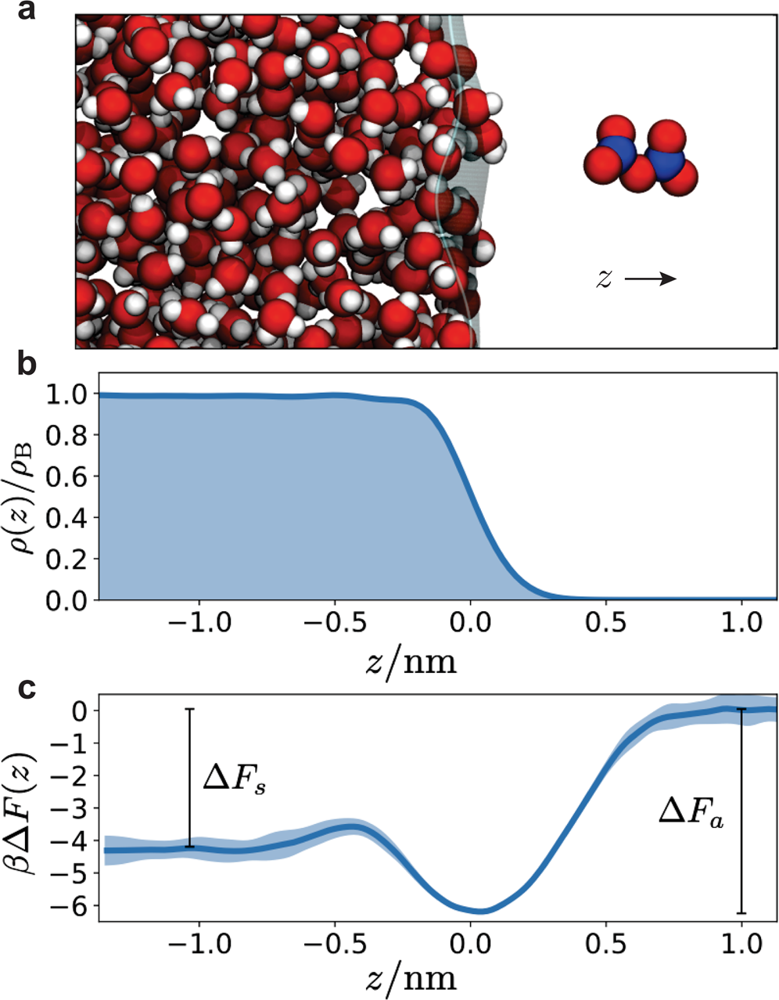
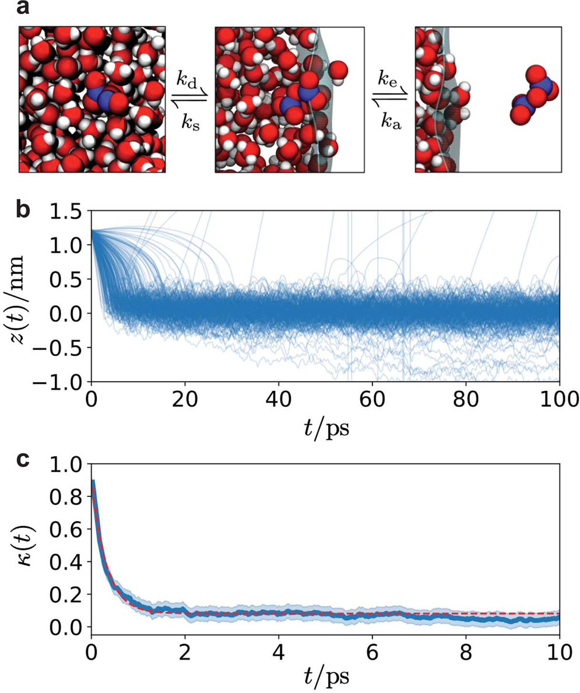
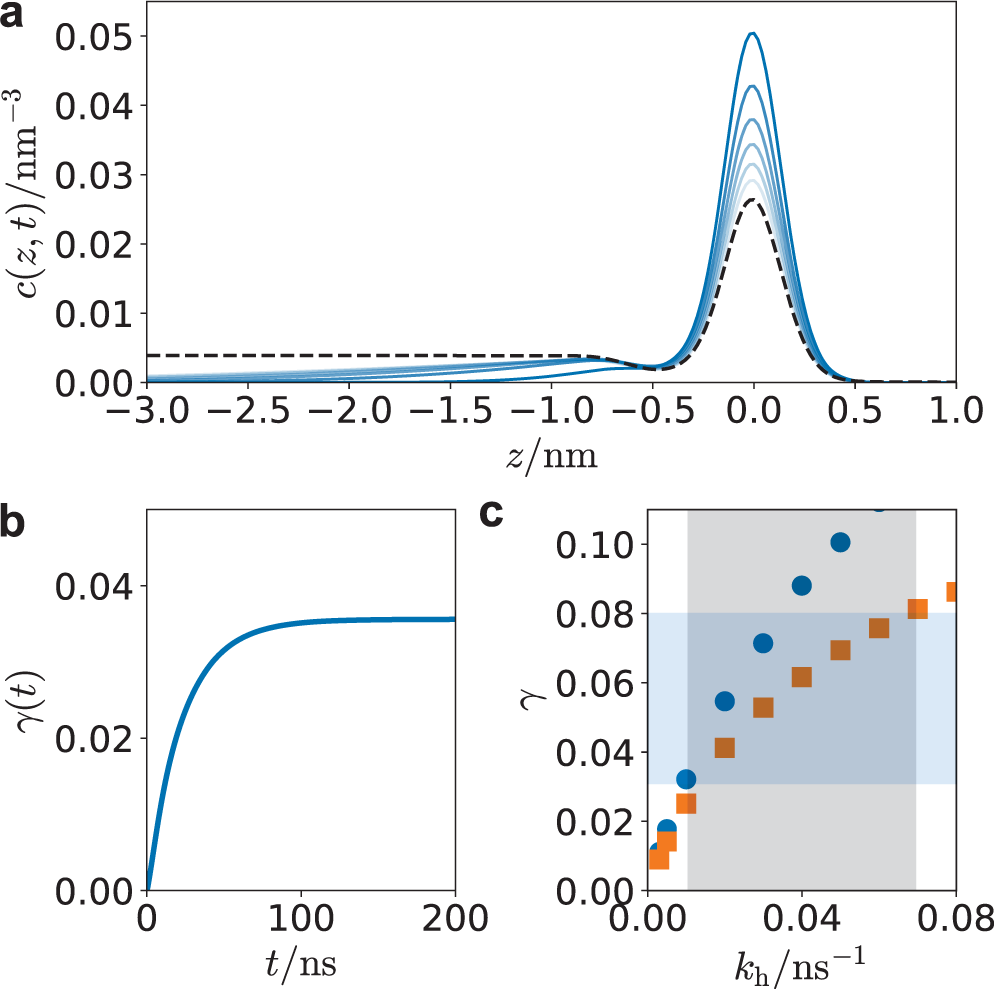

> **论文标题** Uptake of N₂O₅ by aqueous aerosol unveiled using chemically accurate many-body potentials
> **作者** Vinícius Wilian D. Cruzeiro, Mirza Galib, David T. Limmer, Andreas W. Götz
> **发表** Nature Communications, 2022. DOI: 10.1038/s41467-022-28697-8
> **难度** ⭐⭐⭐
> **前置知识** 分子动力学基础、自由能计算（umbrella sampling）、反应-扩散方程、大气化学中气溶胶摄取基本概念

---

## 总览

### 创新点

N₂O₅ 在气溶胶水溶液中的反应性摄取是大气 NOx 的主要汇之一，但定量摄取机制长期缺失。本文用耦合簇精度（CCSD(T)级别）的多体势 MB-nrg 驱动 MD 模拟 + 增强采样，定量计算了 N₂O₅ 在水中的热力学和动力学参数，再将这些参数代入反应-扩散方程反推出水解速率，给出 N₂O₅ 反应性摄取的完整定量图像。

### 摘要

- N₂O₅ 在大气气溶胶水溶液中的反应性摄取是 NOx 的主要损失通道（占对流层 NOx 损失的 15-50%）
- 基于半经验力场或 DFT 的传统模拟无法给出定量精度的预测，原因是摄取系数对自由能差异呈指数敏感
- 本文用 MB-nrg 多体势（以 CCSD(T) 为参考训练的 N₂O₅ + MB-pol 水模型），以化学精度模拟 N₂O₅ 在水-vapor 界面的热力学和动力学行为
- 通过 umbrella sampling 计算了从气相到液相的自由能剖面，发现 N₂O₅ 选择性富集在气液界面、体相溶剂化弱
- 计算了吸附/蒸发速率、溶剂化/去溶剂化速率，得到 Henry 定律常数、粘附系数和质量适应系数
- 用得到的参数构建反应-扩散方程，数值求解反推出与实验一致的水解速率
- 发现反应-扩散长度仅约 2 nm，摄取由界面特征主导，气溶胶粒径依赖性弱

---

## 论文概述

**解决什么问题**：定量揭示 N₂O₅ 在纯水气溶胶中从气相→界面吸附→体相溶剂化→水解反应的全过程摄取机制。

**核心方案**：MB-nrg 多体势（CCSD(T) 精度）驱动力场 MD + umbrella sampling 自由能计算 + 散射轨迹动力学分析 + 反应-扩散方程数值求解。

**主要贡献**：
- 首次用耦合簇精度的多体势给出 N₂O₅ 水溶液摄取的定量热力学和动力学参数
- 揭示了界面选择性吸附决定反应-扩散长度（~2 nm）的核心机制
- 建立了一套从 MD 参数到反应-扩散方程再到实验可测摄取系数的完整桥接框架，可直接推广到含盐等复杂溶液体系

---

## 背景与动机

### N₂O₅ 摄取的经典"电阻模型"及其问题

传统上，N₂O₅ 在气溶胶水溶液中的摄取用"电阻模型"（resistor model）描述：气相 N₂O₅ → 碰撞液面 → 体相溶解 → 体相水解。模型参数依赖体相溶解度和体相水解速率。

但该模型存在两个基本矛盾：

1. **与现场测量不一致**：用体相模型参数预测的摄取系数无法与大气实际观测结果吻合
2. **忽略了界面的独特性质**：气液界面具有有限宽度和独特的介电环境、分子取向，可能具有不同于体相的溶解和反应行为

### 理论计算的精度瓶颈

Galib & Limmer (Science, 2021) 用 DFT 训练的神经网络势模拟发现界面水解占主导，但 DFT 训练数据的固有误差（尤其是电荷转移离域化问题）使结果只能定性一致。摄取系数对自由能呈指数敏感——1 kcal/mol 的自由能差就能导致摄取系数一个数量级的偏差——因此定性精度不够，需要接近化学精度（~0.2 kcal/mol）的势能面。

### MB-nrg 势的优势

MB-nrg（Many-Body-nrg）是一类基于多体展开的数据驱动势能：将总相互作用能显式分解为一体项、二体项、三体项（高阶项用极化项间接覆盖），每一项用 CCSD(T) 参考数据训练。与常见的神经网络势（如 DeepMD）不同，MB-nrg 显式处理长程静电和色散，对气液界面的描述比隐含短程的 NN 势更可靠。

---

## 核心方法

### 整体计算策略

```
CCSD(T) 参考数据 → MB-nrg 势能面（N₂O₅ + MB-pol 水） 
    ↓
Umbrella sampling (z 方向自由能剖面)
    ↓
散射轨迹 (吸附/蒸发速率) + Bennet-Chandler (溶剂化/去溶剂化速率)
    ↓
参数化反应-扩散方程 (Smoluchowski) → 数值求解 → 反推水解速率 → 摄取系数
```

### 势能面

| 项目 | 详情 |
|------|------|
| **水模型** | MB-pol（CCSD(T) 精度多体势，柔性单体，显式包含 1B/2B/3B 相互作用）|
| **N₂O₅ 模型** | MB-nrg，由 Cruzeiro et al., JCTC 2021 开发，以 CCSD(T) 为参考数据训练 |
| **精度层级** | 耦合簇（CCSD(T)），方法层级 Lv.9，属于"金标准"级别 |
| **长程处理** | Ewald 求和，实空间截断 1.2 nm |
| **MB-nrg vs NN 势** | 显式长程静电+色散 vs 依赖短程描述符隐式学习长程 |

MB-nrg 势不描述 N₂O₅ 的水解反应本身——这是一个关键局限。但它能精确描述反应前的所有物理过程（吸附、溶解、扩散），这正是传统方法最薄弱的一环。

### 模拟体系与参数

| 参数 | 设置 |
|------|------|
| **体系** | 533 个 MB-pol 水分子形成液体 slab + 1 个 N₂O₅ 分子 |
| **Slab 尺寸** | 2.416 × 2.416 × 2.772 nm³（截面）|
| **模拟盒子** | 同截面 × 20 nm 长（留出气相空间）|
| **软件** | Amber 2020 + MBX 库 |
| **系综** | NVT, T = 300 K, Langevin 恒温器 |
| **时间步长** | 0.5 fs |
| **动力学计算** | NVE 系综（恒能量）以避免恒温器干扰 |

### 自由能计算：Umbrella Sampling

- **集体变量 (CV)**：N₂O₅ 质心与 slab 质心在 z 方向的距离
- **窗口数**：52 个独立窗口，z* 从 -1.36 到 1.19 nm 均匀分布
- **偏置势**：谐振势，力常数 k = 2.5 kcal/mol/Ų
- **每窗口采样**：1 ns 平衡 + 2.5 ns 生产
- **自由能重构**：Umbrella Integration（而非 WHAM）
- **重复**：3 组独立计算，标准差作为误差棒

### 动力学计算

**吸附/蒸发速率**（散射轨迹法）：
- N₂O₅ 初始置于 z = 1.2 nm（气相），Maxwell-Boltzmann 分布速度
- 10 组独立构型 × 25 组速度 = 250 条轨迹，每条 100 ps
- 统计粘附概率 → 热适应系数 S → 吸附速率 kₐ → 蒸发速率 kₑ

**溶剂化/去溶剂化速率**（Bennet-Chandler 方法）：
- 过渡态位置：z† = -0.42 nm（自由能剖面上的势垒位置）
- 80 组构型 × 25 组速度 = 2000 条轨迹，每条 10 ps
- 计算传输系数 κ → 去溶剂化速率 k_d → 溶剂化速率 k_s

### 反应-扩散方程

用 Smoluchowski 方程（overdamped 极限下的 Fokker-Planck 方程）：

∂c/∂t = ∂/∂z[D(z)·e^(-βΔF(z))·∂/∂z(e^(βΔF(z))·c)] − k_h(z)·c

- **第一项**：漂移-扩散项，编码了自由能剖面决定的稳态分布
- **第二项**：反应损失项，k_h(z) 为未知水解速率
- **边界条件**：z = 1 nm 处吸收边界（模拟蒸发损失），z = -30 nm 处反射边界（模拟体相深处）
- **数值求解**：有限差分，Δz = 0.02 nm，Δt = 0.018 ps
- **初始条件**：界面极小处的归一化高斯分布

关键简化——水解速率设为二值模型：体相区（z < -0.5 nm）为 k_h，界面区（-0.5 < z < 0.5 nm）为 k_h 的某个比例，气相区为 0。

---

## 结果与讨论

### 思路整理

1. 先计算自由能剖面 → 获得吸附/溶剂化热力学
2. 从自由能导出 Henry 定律常数 → 与实验对比验证模型精度
3. 计算扩散系数 → 为动力学分析做准备
4. 散射轨迹 → 获得吸附/蒸发速率
5. Bennet-Chandler 方法 → 获得溶剂化/去溶剂化速率
6. 将上述参数代入反应-扩散方程 → 反推水解速率 → 与实验摄取系数匹配
7. 分析反应-扩散长度 → 得出结论：摄取由界面特征主导

### 结果详情

#### 1. 自由能剖面



**图示内容**：(a) N₂O₅ 在气液界面的特征快照；(b) 水密度沿 z 方向的分布；(c) N₂O₅ 沿 z 方向的自由能剖面。

**关键信息**：
- 吸附自由能 βΔFₐ = -6.2 ± 0.1（约 3.7 kcal/mol），即 N₂O₅ 在界面比在气相中稳定约 3.7 kcal/mol
- 溶剂化自由能 βΔF_s = -4.3 ± 0.1（约 2.6 kcal/mol），比吸附自由能浅，说明体相溶解不如界面吸附有利
- 从界面到体相的势垒 βΔF_b = 0.8（约 0.5 kcal/mol）
- 自由能剖面非单调，在 Gibbs 分割面附近有全局极小值，确认 N₂O₅ 界面选择性富集

自由能剖面的物理图景：N₂O₅ 从气相进入水体时，先在界面"陷阱"中被捕获（ΔFₐ = -6.2 kT），要进入体相还需翻过一个小势垒（0.8 kT）。这决定了平衡时 N₂O₅ 在界面处的密度显著高于体相。

#### 2. Henry 定律常数

H = 3.0 ± 0.4 M/atm，与实验推断值（1-10 M/atm）一致，高于之前固定电荷力场和 NN 势的结果（~0.5 M/atm）。这一差异来自 MB-nrg 对弱相互作用的更精确描述——CCSD(T) 级别的多体展开比 DFT 或经验力场更准确地捕捉了 N₂O₅-H₂O 的色散和极化。

#### 3. 扩散系数

| 位置 | D (10⁻⁵ cm²/s) |
|------|----------------|
| 体相（原始）| 1.53 ± 0.06 |
| 体相（有限尺寸校正后）| 1.89 ± 0.06 |
| 界面 | 5.3 ± 0.1 |

界面扩散系数是体相的约 3 倍——界面的分子排列更"松散"，N₂O₅ 受到的摩擦阻力更小。

#### 4. 动力学速率常数



**图示内容**：(a) N₂O₅ 吸附/蒸发（气相-界面）和溶剂化/去溶剂化（界面-体相）的示意图及速率常数；(b) 250 条散射轨迹中 N₂O₅ 质心 z 分量的时间演化；(c) 界面→体相跃迁的传输系数 κ(t)。

**关键结果**：

| 参数 | 值 | 含义 |
|------|-----|------|
| 热适应系数 S | 0.96 ± 0.06 | 碰撞界面后粘附的概率 |
| 质量适应系数 α | 0.93 ± 0.06 | 碰面后最终进入体相的概率 |
| kₐ (吸附）| 57 nm/ns | 快过程 |
| kₑ (蒸发）| 0.11 nm/ns | 慢，受吸附自由能限制 |
| k_d (去溶剂化）| 340 /ns | 界面→体相 |
| k_s (溶剂化）| 51 /ns | 体相→界面 |

S ≈ 1 意味着 N₂O₅ 碰到水面几乎必然粘附，吸附无势垒。κ 随时间从 1 衰减到 0.08，符合扩散控制的势垒跨越特征（非弹道跨越）。

#### 5. 反应性摄取系数与水解速率反推



**图示内容**：(a) 浓度剖面随时间弛豫（蓝线间隔 0.25 ns，虚线黑为平衡分布）；(b) 反应性摄取系数 γ(t) 的时间演化；(c) 渐进取取系数与体相水解速率的关系（蓝色圆：有界面反应性，橙色方：仅体相反应）。

**核心结果**：
- 实验摄取系数 0.03-0.08 → 反推出体相水解速率 k_h = 0.01-0.07 ns⁻¹（均值约 0.04 ns⁻¹）
- 界面水解最多贡献摄取系数的 20%
- 反应-扩散长度（无势垒时）~15 nm，实际有效传播深度仅约 2 nm
- 结论：**大部分水解发生在体相，但摄取的整体速率由界面特征主导**——界面吸附降低了进入体相的驱动力，从而压缩了有效的反应-扩散长度

#### 6. 与不同方法的对比

| 来源 | k_h (ns⁻¹) | 说明 |
|------|-----------|------|
| 本文（MB-nrg + 反应-扩散）| 0.04 ± 0.03 | 与实验摄取系数一致 |
| Galib & Limmer, Science 2021 (NN 势）| 0.2 | DFT 训练，电荷转移离域化高估反应速率 |
| 实验推断（Gaston & Thornton, 2016）| 0.002 | 基于忽略了界面效应的电阻模型，严重低估 |

三层对比说明：势能面精度至关重要（DFT→CCSD(T) 将 k_h 修正约 5 倍），模型假设也同样重要（经典电阻模型的低估达 20 倍）。

---

## 总结

### 核心贡献

1. **用化学精度填补了 N₂O₅ 气相摄取物理过程的定量空白**：给出了经 CCSD(T) 验证的吸附自由能、溶剂化自由能、Henry 常数、扩散系数、粘附系数、质量适应系数、各基元过程的速率常数
2. **建立了 MD 参数→反应-扩散方程→实验可测量的桥接框架**：不直接模拟反应，而是用精确的物理参数约束反应-扩散方程，间接反推出水解速率
3. **给出机制层面上的定量判断**：界面水解最多占 20%；摄取受界面吸附控制而非体相水解控制；有效反应-扩散长度仅 ~2 nm

### 局限性

1. N₂O₅ 势不包含反应性——无法直接模拟水解过程，只能间接反推
2. 仅考虑了纯水体系，实际气溶胶含无机盐（硝酸盐、氯盐等），盐效应可能显著改变界面结构和水解途径
3. 水解速率设为 z 方向的 step 函数（二值模型），未考虑界面区域水解速率的连续变化
4. 反应-扩散方程是 over-damped 近似（Smoluchowski 方程），对气相区域用吸收边界条件简化处理
5. 体系 size 有限（533 水分子），虽然热力学量已收敛，但界面波动和长程关联可能受影响
6. 未考虑量子核效应（路径积分 MD），对涉及质子转移的水解反应这可能有一定影响

### 适用场景

- **适合**：为大气化学模型中 N₂O₅ 摄取模块提供新型参数化方案；作为进一步研究含盐溶液摄取的理论框架起点；推广到其他微量气体的气溶胶摄取问题
- **不适合**：直接预测非水体系或有机气溶胶的 N₂O₅ 摄取；讨论 N₂O₅ 水解的微观反应机理（需要反应性势或 QM/MM）

---

## Q&A

**Q1: 为什么 MB-nrg 势的选择对这项研究如此关键？用经典力场或 DFT 级别做不到吗？**

两种替代方案各有致命弱点：

经典力场（如 OPLS + TIP3P）：固定电荷模型无法描述界面的极化效应，对 N₂O₅ 这种含极性共价键分子的界面吸附自由能可能产生数 kcal/mol 的偏离。而摄取系数对自由能差呈指数关系——e^(βΔΔF)，1 kcal/mol 差就能带来约 5 倍的摄取系数偏差。

NN 势（如 DeepMD）用 DFT 数据训练：DFT 本身有离域化误差（delocalization error），倾向于高估电荷转移，导致预测的 N₂O₅ 水解速率偏大（0.2 ns⁻¹ vs 本文 0.04 ns⁻¹）。此外常见 NN 势隐式学习长程相互作用，对气液界面这种密度急剧变化的区域的描述不如显式长程的 MB-nrg。

MB-nrg 以 CCSD(T) 为参考训练，且显式包含 1B+2B+3B 多体项和长程极化/色散，刚好在这两个薄弱环节上都做到位。

**Q2: Umbrella Sampling 中只用了一个 CV（z 方向距离），这是否足够描述 N₂O₅ 的溶剂化过程？什么情况下可能需要更多 CV？**

对 N₂O₅ 在水中的溶剂化而言，z 作为单一 CV 是合理的，原因在于这一过程的自由能主要障碍是分子的空间位置变化——从气相跨越界面进入体相水。N₂O₅ 的分子取向弛豫（旋转自由度）在水中的时间尺度远快于平动跨越界面，因此取向自由度可以被视为"快变量"被有效平均。

但如果需要解析更复杂的溶剂化过程（如伴随构象变化、氢键重排、或界面处的优先取向效应），就可能需要增加 CV，例如 N₂O₅ 分子轴相对界面法线的取向角、或 N₂O₅ 周围第一溶剂化壳层的水分子配位数。这恰好是为什么 MB-nrg 的选择如此重要——如果势本身不准确，加再多 CV 也无济于事。

一个细微的质疑：z = -0.42 nm 处的势垒（0.8 kT ≈ 0.48 kcal/mol）其实低于 kT，按理说不应该构成真正的动力学瓶颈。那为什么还需要增强采样？因为 kT 级别的势垒虽然不高，但在 533 个水分子组成的非均质体系中，纯粹的 MD 采样自然跨越这一势垒需要的时间远超可及范围——N₂O₅ 会长时间陷在界面极小中。

**Q3: 论文说"大部分水解发生在体相，但摄取由界面特征主导"，这矛盾吗？**

不矛盾，关键在于区分"反应发生在哪"和"什么限制了总速率"。

N₂O₅ 进入水体的过程分三步：(1) 气相→界面吸附；(2) 界面→体相溶剂化；(3) 体相水解。步骤 (2) 需翻越 0.8 kT 势垒，且界面处的自由能最低（-6.2 kT），导致 N₂O₅ 大量"囤积"在界面。结果是：尽管体相中有大量水分子参与水解（→大部分反应在体相发生），但 N₂O₅ 的体相浓度持续受界面势垒的限制，总摄取速率被界面处的传质速率控制。

可以用类比理解：一条高速公路（体相水解很快）但入口只有一个收费站（界面吸附→溶剂化为瓶颈）——大部分"通行"确实发生在高速公路上，但总流量由收费站决定。

这一结论与 Galib & Limmer (2021) 的差异在于：后者用 DFT-NN 势发现界面水解足够快到让体相基本不参与，而本文用更高精度的势发现体相仍然是主场，但摄取总量仍然被界面特征控制。

**Q4: 用反应-扩散方程间接反推 k_h 的方法，与直接用反应性力场（如 ReaxFF）模拟水解有什么区别？**

ReaxFF 直接模拟化学键的断裂和生成，可以给出反应机理层面的细节（反应路径、中间体结构、溶剂水分子的具体角色）。但它的精度上限通常在几个 kcal/mol 级别，而且参数化极其依赖训练集的选择。

本文的间接方法的优势是：物理过程（吸附、扩散、蒸发）由 CCSD(T) 精度的势精确描述，唯一未知量 k_h 通过与实验摄取系数对标来标定——相当于用实验做了一次参数校准。代价是失去了对反应机理的分子级洞察（例如无法回答"水解是协同过程还是分步 SN2"）。

两种方法互补而非互斥：本文给出可靠的宏观参数，ReaxFF/DFT/QM-MM 给出微观反应细节。理想情况是用本文的参数（k_h ~ 0.04 ns⁻¹）去验证或指导反应性力场的开发和校准。

**Q5: 论文预测 N₂O₅ 有效反应-扩散长度仅 ~2 nm，对气溶胶粒径依赖性弱。如果粒子直径只有 10 nm 甚至更小呢？结论还成立吗？**

这篇论文的 slab 模拟本质上对应的是平界面（无限大液面），对应的"粒径"是无穷大。当粒子直径降至 ~10 nm 时，会出现两个额外效应：

1. **曲率效应**：界面张力（Kelvin 效应）会改变 N₂O₅ 的平衡吸附自由能和有效 Henry 常数
2. **有限尺寸效应**：当扩散长度（~2 nm）与粒子半径可比时，N₂O₅ 可能在到达"体相中心"之前就完成反应，摄取系数可能反而增大

论文将反应-扩散长度与体相水解速率联系起来讨论粒径依赖性，是为了解释某些野外测量中观察到的弱尺寸依赖现象。但严格来说，对于 <10 nm 的纳米液滴，需要显式球对称反应-扩散模拟或直接做液滴的 MD 才能最终确认。这部分在原文中属于推测（"predicts a very weak aerosol particle size dependence"），而非模拟直接验证的结果。
